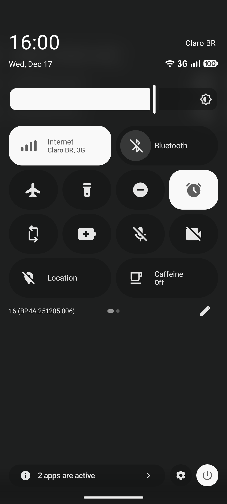
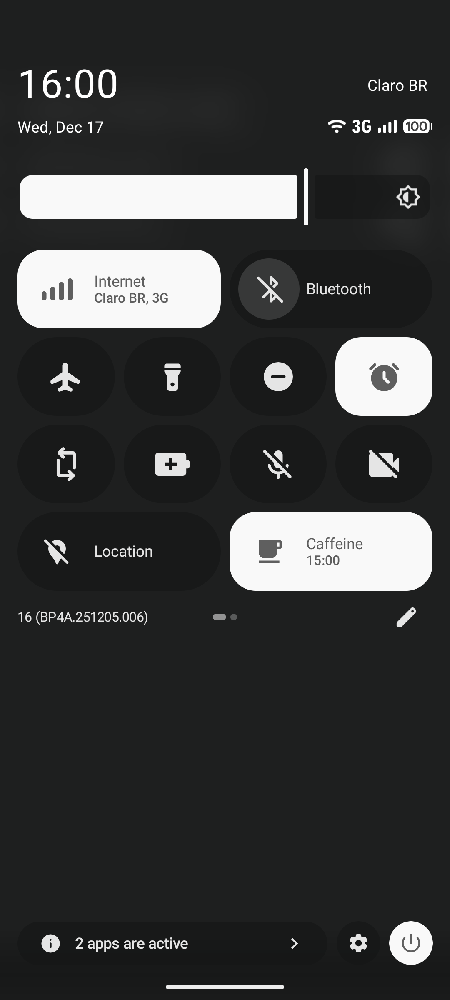

Caff
====

Caff is a minimal Android application that provides a quick settings tile
implementing Caffeine Mode functionality (similar to LineageOS).

## Usage

Tapping the quick settings tile will toggle caffeine and cycle through
different durations. If the tile is unavailable, you will have to disable
battery optimizations (see [notes](#notes)). Long-pressing the tile will
show a preferences menu, where custom durations can be added/removed.

## Building

If you have `nix`, you can get a development shell
with all dependencies set up by running:

```sh
$ nix develop
```

If you don't have `nix` you will have to install the
dependencies manually.

Then, to build the project, run

```sh
$ gradle build
```

The APK will be available in `app/build/outputs/apk/`.

## Screenshots






## Notes

For the app to work properly in Android 12 or later, you
will have to disable battery optimizations for the app
(go to `App info` $\rightarrow$ `App battery usage` and
set it to `Unrestricted`).
